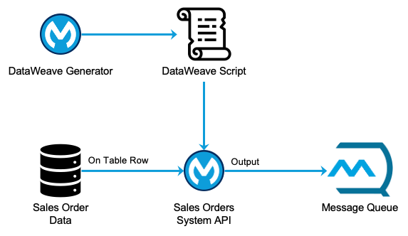

# Generate a DataWeave Script Dynamically
## Overview

This repository contains two Mule applications created to demonstrate how to generate a DataWeave script dynamically. First, the actual design and implementation were influenced by a use case a customer provided. That said, the focus of the demo was to showcase the art of the possible while keeping the implementation as simple as possible.

As illustrated in the diagram above, the two Mule applications are:

1. The **DataWeave Generator** application, as its name implies, demonstrates how to generate a DataWeave script dynamically based on a basic JSON configuration file.
2. The customer's use case influenced the **Sales Order System API** (and other related assets), which showcases how to use a Dynamic Evaluate component within a Mule flow in conjunction with the generated DataWeave script.

## Typical Demo Flow

A typical demo starts by showing data flowing from the database table to the message queue.

1. The Sales Order System API runs in Cloud Hub and subscribes to changes to a Postgres database table (which acts as the system of records for Sales Order data in the demo).
2. A handful of Sales Order headers is inserted into the Postgres database table, which get picked up one row at a time by the Sales Order System API.
3. The Sales Order System API:
   - Retrieves the default DataWeave script to use from a second Postgres database table (which acts as the DataWeave scripts repository in the demo), and
   - Transforms the row data and publishes it to an Anypoint MQ queue.
4. A few messages from the queue are shown to illustrate the output produced using the default DataWeave script.

The second part of the demo shows updating the default DataWeave script using a new configuration and the new queued messages reflecting those changes.

1. First, a request is submitted to the DataWeave Generator API to regenerate and update the relevant DataWeave script using a new configuration (e.g., add or change fields, change content type from JSON to XML).
2. Another handful of Sales Order headers is inserted into the Postgres database table, which automatically gets picked up and processed.
3. A few messages from the queue are shown to illustrate the new output format, which also demonstrates that the Sales Order System API retrieved and automatically used the updated DataWeave script.

> [!NOTE]
> As mentioned before, the customer's use case influenced or mandated the process above and the actors involved (i.e., database, message queue).

## Repository Content

- The folder **anypoint-studio-projects** includes the source code of the two Mule applications.
- The folder **documentation**, as the name implies, basic documentation on the implementation and on how to run the Mule applications.
- The folder **postman-collection** contains a basic Postman collection for interacting with the two Mule applications. The Postman collection contains essential documentation to provide additional details.
- The folder **resources** includes miscellaneous resources for setting up the database and testing the two Mule applications. This folder contains a `_README.md` file to provide additional details.
