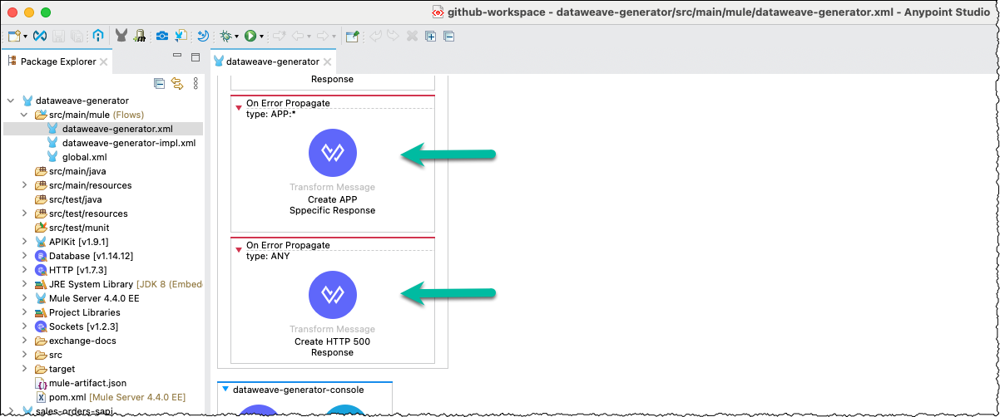

# Generate a DataWeave Script Dynamically Overview

## Table of Contents

- [Introduction](#introduction)
  - [Typical Demo Flow](#typical-demo-flow)
- [Implementation Overview](#implementation-overview)
  - [DataWeave Generator API Overview](#dataweave-generator-api-overview)
  - [Sales Order System API Overview](#sales-order-system-api-overview)
- [Appendix](#appendix)
  - [Comprehensive Error Body](#comprehensive-error-body)

## Introduction

The two Mule applications contained in this repository demonstrate how to generate a DataWeave script dynamically. However, the actual design and implementation were influenced by a use case a customer provided. That said, the focus of the demo was to showcase the art of the possible while keeping the implementation as simple as possible.


As illustrated in the diagram above, the two Mule applications are:

1. The **DataWeave Generator API**, as its name implies, demonstrates how to generate a DataWeave script dynamically based on basic configuration information.
2. The customer's use case influenced the **Sales Order System API** (and other related assets), which showcases how to use a **Dynamic Evaluate** component within a Mule flow in conjunction with the generated DataWeave script.

### Typical Demo Flow

A typical demo starts by showing data flowing from the database table to the message queue.

1. The **Sales Order System API** runs in Cloud Hub and subscribes to changes to a Postgres database table (which acts as the system of records for Sales Order data in the demo).
2. A handful of **Sales Order Headers** is inserted into the Postgres database table, which get picked up one row at a time by the **Sales Order System API**.
3. The **Sales Order System API**:
   - Retrieves the default DataWeave script to use from a second Postgres database table (which acts as the DataWeave scripts repository in the demo), and
   - Transforms the row data and publishes it to an Anypoint MQ queue.
4. A few messages from the queue are shown to illustrate the output produced using the default DataWeave script.

The second part of the demo shows 1) updating the default DataWeave script using a new configuration and 2) the new queued messages that reflect those changes.


1. First, a request is submitted to the **DataWeave Generator API** to regenerate and update the relevant DataWeave script using a new configuration (e.g., add or change fields, change content type from JSON to XML).
2. Another handful of **Sales Order Headers** is inserted into the Postgres database table, which automatically gets picked up and processed.
3. A few messages from the queue are shown to illustrate the new output format, which also demonstrates that the **Sales Order System API** retrieved and automatically used the updated DataWeave script.


> [!NOTE]
> As mentioned before, the customer's use case influenced or mandated the process above and the actors involved (i.e., database, message queue).

#### Examples
The following is an example of configuration information to generate a DataWeave script.

```json
{
  "scriptName": "sales-order-header-script",
  "contentType": "XML",
  "xmlRootElement": "orders",
  "fields": "sales_order_id,order_date,status,sub_total,total_due"
}
```

- The `scriptName` property uniquely identifies the generated DataWeave script. It is the primary key in the Postgres database table (which acts as the DataWeave scripts repository in the demo).
- The `contentType` property prescribes the output directive in the generated DataWeave script - e.g., `output application/json`, `output application/xml`.
- The `xmlRootElement` property is required when the `contentType` property is XML. It is optional and ignored in all other cases. The `xmlRootElement` property, as its name implies, specifies the XML root element that encapsulate the fields mapped in the generated DataWeave script.
- The `fields` property enumerates the fields to retrieve from the input payload and map the output payload in the generated DataWeave script.

The **DataWeave Generator API** generates the following DataWeave script from the configuration example above.

```
%dw 2.0
output application/xml
---
{
  orders: {
    sales_order_id: payload.sales_order_id,
    order_date: payload.order_date,
    status: payload.status,
    sub_total: payload.sub_total,
    total_due: payload.total_due
  }
}
```

Finally, the **Sales Order System API** uses the generated DataWeave script example above and produces the following output.

```xml
<?xml version="1.0" encoding="UTF-8"?>
<orders>
    <sales_order_id>37</sales_order_id>
    <order_date>2023/09/04</order_date>
    <status>New</status>
    <sub_total>8776.64</sub_total>
    <total_due>9303.24</total_due>
</orders>
```

## Implementation Overview

> [!NOTE]
> The content in this section assumes 1) you are familiar with Anypoint Studio and building Mule flows, and 2) you cloned or downloaded the Anypoint Studio projects from GitHub and imported them into Anypoint Studio. As such, it intentionally does not provide a lot of details about the implementation and does not include XML snippets.

### DataWeave Generator API Overview

The DataWeave Generator API is implemented as a REST API specified using the RESTful API Modeling Language (RAML). You can find the API specification in the subfolder [`src/main/resources/api`](../anypoint-studio-projects/dataweave-generator/src/main/resources/api/dataweave-generator.raml).

- As per its specification, this API exposes one resource, namely `/dw-scripts`, and the following methods:
  - `GET`: Retrieves all DataWeave scripts from the repository.
  - `GET` (by script name): Retrieves the DataWeave script identified by the specified script name supplied as a URI parameter.
  - `POST`: Generates a new DataWeave script using the configuration information in the request body.
  - `DELETE`: Deletes the DataWeave script identified by the specified script name supplied as a URI parameter.
  - `PUT`: Regenerates the DataWeave script identified by the specified script name supplied as a URI parameter and using the configuration information in the request body.


- Naturally, the project leverages a properties file. It is in YAML format, and the naming convention is `mule-props-<environment>` to support environment-specific files – e.g., `mule-props-dev.yaml`, `mule-props-test.yaml`, `mule-props-staging.yaml`.


> [!IMPORTANT]
> As per infosec best practices, the project does not include the `mule-props-dev.yaml` properties file as it contains credentials. However, the template enables you to create one specific to your own implementation and resources.

- The implementation leverages three Mule configuration files as per MuleSoft best practices.
  - The file `global.xml` stores all global elements, which is useful when a project contains multiple Mule configuration (XML) files - e.g., you do not have to look in each file to find a specific global element.
  - The file `dataweave-generator.xml` represents the API interface, so to speak. It is the output of the scaffolding and the default Mule configuration file.
  - The file `dataweave-generator-impl.xml` contains the API implementation.


> [!TIP]
> The separation of the API interface and API implementation makes it easier and more reliable to redo the scaffolding when updating the API specification. For example, redoing the scaffolding rarely, if ever, breaks the implementation.

#### Mule Configuration File `global.xml`

- In the `global.xml` file, notice the following two global configuration elements.

  - First, the global property named `env`, which specifies the current environment - e.g., dev in the screen capture.

  

> [!TIP]
> This typical practice enables you to override this property when deploying your application to higher environments (e.g., test, QA, prod), which results in picking up the properties file specific to that environment.

  - Second, the configuration properties, which follows the naming convention of `mule-props-<environment>` to support environment-specific files.

  

#### Mule Configuration File `dataweave-generator.xml`

- In the `dataweave-generator.xml` file, notice the error handlers.

  - First, the **Transform Message** components have meaningful or self-describing names.

  

  - Then, notice the addition of two catch-all error handlers.
    - The first handles any custom errors the application might intentionally throw.
    - The second handles any errors not already covered by another error handler.

  

  - All error handlers use a (more) comprehensive body when returning an error. The JSON object and its properties are influenced by API specifications and fragments published in **Anypoint Exchange** – e.g. accelerators and templates.

  

> [!NOTE]
> Refer to the section [Comprehensive Error Body](#comprehensive-error-body) in the appendix for more information.

  - Finally, as stated before, the file `dataweave-generator.xml` represents the API interface and is the API specification's scaffolding output. Naturally, the generated flows leverage a **Flow Reference** component to point to their implementation.
    

#### Mule Configuration File `dataweave-generator-impl.xml`

The file `dataweave-generator-impl.xml` contains the API implementation. It includes five flows or one per method exposed by the **DataWeave Generator API**.

##### About The DataWeave Scripts Repository

The five flows implemented in the file `dataweave-generator-impl.xml` abstract interacting with the DataWeave scripts repository. As mentioned, this demo uses a Postgres database table for many reasons. Using an SQL database to store DataWeave scripts with a **Dynamic Evaluate** component in a Mule flow to execute them is not a novel idea. Many MuleSoft customers use that pattern to address miscellaneous use cases. SQL databases are ubiquitous, practical, and easy to use. You could easily use other technologies, such as a NoSQL database or a file system.

For this demo, the [schema of the PostgreSQL database table](../resources/Create-DB-Table-dataweave_script.sql) is as follows:

```sql
CREATE TABLE public.dataweave_script
(
  script_name TEXT PRIMARY KEY,
  configuration TEXT NOT NULL,
  dw_script TEXT NOT NULL
);
```

The column names are self-descriptive, but note the following:
- The `configuration` column holds the configuration information as a string even though it is in JSON format. The five Mule flows include additional processing to convert the configuration information from JSON to string and vice versa for practical reasons.
- Similarly, the `dw_script` column holds the generated DataWeave script as a string. As of the time of this writing, the five Mule flows do not include additional processing to convert the DataWeave scripts into a prettier format for display and logging.

##### Mule Flow `delete-dw-script-impl-flow`
As its name implies, this flow implements the `DELETE` method and deletes the DataWeave script identified by the specified script name supplied as a URI parameter in the database table.


This flow returns an HTTP status code 204 with an empty response body even if the specified script does not exist.

##### Mule Flow `get-dw-scripts-impl-flow`
As its name implies, this flow implements the `GET` method and retrieves all DataWeave scripts from the database table.


##### Mule Flow `get-dw-script-by-name-impl-flow`
As its name implies, this flow implements the `GET` (by script name) method and retrieves the DataWeave script identified by the specified script name supplied as a URI parameter from the database table.


This flow returns an error with an HTTP status code 404 if the specified script does not exist.

##### Mule Flow `post-dw-script-impl-flow`
As its name implies, this flow implements the `POST` method and generates a new DataWeave script using the configuration information in the request body. Finally, it stores the configuration information and generated DataWeave script into the database table.


This flow returns a JSON object that includes the configuration information and the generated DataWeave script. The following is an example:

```json
{
  "configuration": {
    "scriptName": "sales-order-header-script",
    "contentType": "JSON",
    "fields": "sales_order_id,order_date,status,sub_total,total_due"
  },
  "dwScript": "%dw 2.0\noutput application/json\n---\n{\n  sales_order_id: payload.sales_order_id,\n  order_date: payload.order_date,\n  status: payload.status,\n  sub_total: payload.sub_total,\n  total_due: payload.total_due\n}\n"
}
```

Finally, this flow returns an error with an HTTP status code 409 if the specified script to generate already exists in the database table.

##### Mule Flow `put-dw-script-impl-flow`

As its name implies, this flow implements the `PUT` method and regenerates the DataWeave script identified by the specified script name supplied as a URI parameter and using the configuration information in the request body. Finally, it stores the configuration information and regenerated DataWeave script into the database table.


Similarly, this flow returns a JSON object that includes the configuration information and the regenerated DataWeave script. The following is an example:

```json
{
  "configuration": {
    "scriptName": "sales-order-header-script",
    "contentType": "XML",
    "xmlRootElement": "orders",
    "fields": "sales_order_id,order_date,status,sub_total,total_due"
  },
  "dwScript": "%dw 2.0\noutput application/xml\n---\n{\n  orders: {\n    sales_order_id: payload.sales_order_id,\n    order_date: payload.order_date,\n    status: payload.status,\n    sub_total: payload.sub_total,\n    total_due: payload.total_due\n  }\n}\n"
}
```

Finally, this flow returns an error with an HTTP status code 404 if the specified script to regenerate does not exist in the database table.

### Sales Order System API Overview

Similarly, the Sales Order System API is implemented as a REST API specified using the RESTful API Modeling Language (RAML). You can find the API specification in the subfolder [`src/main/resources/api`](../anypoint-studio-projects/sales-orders-sapi/src/main/resources/api/sales-orders-sapi.raml).

> [!NOTE]
> Arguably, the API specification is extraneous, as the sole purpose of this API is to subscribe to changes to a Postgres database table (which acts as the system of records for Sales Order data). Regardless, the implementation includes an API specification to support unit testing.

- The API specification exposes one resource, namely `/sales-orders/headers`, and a single method:
  - `GET`: Retrieve all Sales Order Headers from the system of record.


- Naturally, the project leverages a properties file.


- The implementation also leverages three Mule configuration files as per MuleSoft best practices.
  - The file `global.xml` stores all global elements.
  - The file `dataweave-generator.xml` represents the API interface.
  - The file `dataweave-generator-impl.xml` contains the API implementation.


#### Mule Configuration File `global.xml`

- The Sales Order System API `global.xml` follows the same practices implemented in the DataWeave Generator API. Namely:
  - Defines a global property named `env` to specify the current system environment - e.g., dev in the screen capture.
  - Defines the configuration properties element to follow the naming convention of `mule-props-<environment>`.


#### Mule Configuration File `sales-orders-sapi.xml`

- Similarly, the Mule configuration file `sales-orders-sapi.xml` follows the same practices implemented in the DataWeave Generator API. Namely:
  - Uses meaningful or self-describing names for all error handlers.
  - Adds a catch-all error handler for any errors not already covered by another error handler.
  - Leverages a **Flow Reference** component in flows to point to their implementation.


#### Mule Configuration File `sales-orders-sapi-impl.xml`

Naturally, the file `sales-orders-sapi-impl.xml` contains the API implementation. It includes one flow for the single method exposed by the **Sales Order System API**, a second that subscribes to changes to the Postgres database table, and a third that retrieves the relevant DataWeave script from the database table.

> [!NOTE]
> This implementation does not include any additional error handling to keep it as simple as possible, as it was created to support a demo.

##### Mule Flow `get-orders-headers-impl-flow`
As its name implies, this flow implements the `GET` method and retrieves all Sales Order Headers from the database table. As mentioned, this method and its implementation are included to support unit testing.


##### Mule Flow `get-dataweave-script-flow`
This flow retrieves the relevant DataWeave script from the database table. As illustrated in the screen capture, it connects directly to the database table. Instead, you could update it to leverage the `GET by script name` method of the DataWeave Generator API.


##### Mule Flow `orders-headers-subscriber-flow`
As its name implies, this flow subscribes to changes to the Postgres database table using the [database connector `On Table Row` source](https://docs.mulesoft.com/db-connector/latest/database-documentation#listener).


# Appendix

## Comprehensive Error Body

As stated and illustrated in the section **DataWeave Generator API Overview**, all error handlers use a (more) comprehensive body when returning an error. Following is an example of the payload returned when an error occurs.

```json
{
  "dateTime": "2023-01-01T08:00:00.000-08:00",
  "httpStatus": "400",
  "summaryMessage": "Validation failed (see responseDetails for more information)",
  "errorType": "APP.VALIDATION_FAILED",
  "responseStatus": "ERROR",
  "responseDetails": [
    {
      "severity": "ERROR",
      "code": "VAL1004",
      "message": "Customer number not found in target system"
    }
  ]
}
```

Following is more information about the properties.

| **Property**     | **Required?** | **Description**                                              |
| ---------------- | ------------- | ------------------------------------------------------------ |
| dateTime:        | Y             | Date and time we are reporting the error (i.e., Dataweave function now()). |
| httpStatus:      | Y             | HTTP status code of the response.                            |
| summaryMessage:  | Y             | Summary message that describes the response's HTTP status code. |
| errorType:       | Y             | Error type, which consist of both the error's namespace and its identifier - e.g., `APP.VALIDATION_FAILED`, `FILE:NOT_FOUND`, `HTTP:UNAUTHORIZED`. |
| responseStatus:  | N             | Optional property that indicates the overall status of the operation (e.g., SUCCESS, WARNING, ERROR). |
| responseDetails: | N             | Optional array, which is a structure for providing additional details to a response returned by an API. |
| severity:        | N             | Indicates the severity of this responseDetails.message (i.e., INFO, WARNING, ERROR). |
| code:            | N             | Represents an optional alphanumeric code that uniquely identifies this message. We included this property to support cataloging messages and provide additional information such as comprehensive descriptions, mitigation, workaround, etc. |
| message:         | N             | Represents the short text or description of this responseDetails.message. |


